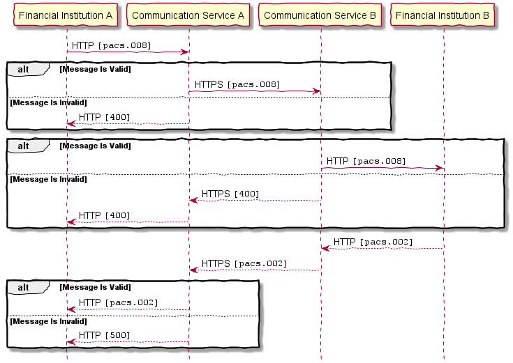

# Decentralized ISO20022 microservice
Financial Inclusion with decentralized ISO20022 as a bidirectional microservice. It consists of two components, the internal API and the external API.
The internal API should be kept private and only accessible by your own financial institution, which could be done using for example a
VPN. Its purpose is to validate outgoing ISO 20022 messages before they are sent to a remote financial institution. The external API is
publicly available for remote financial institutions and can accept and validate incoming ISO 20022 messages before forwarding them
to an internal handler service.

## System overview
An overview of the system.


## Sending and recieving a pacs.008 message
A sequence diagram for sending and recieving a pacs.008 message with the microservice. Communication service represents an instance of the microservice.



## Use in settlement and payments
An example use case of the microservice in payments with FX settlements on a distributed ledger, and the different ISO20022 messages that can be used for communication.


## Technologies
The technologies used in the project. 
- [Spring Boot](https://github.com/spring-projects/spring-boot) is used as the framework.
- [Prowide-ISO20022](https://github.com/prowide/prowide-iso20022) for parsing, editing, and validating ISO20022 messages.

## Demo
The following instructions describe how to run a demo of the system using a mock financial institution handler (mock bank system) and the default configuration.
   1. Start the microservice and mock bank system by running `docker-compose -f docker-compose.demo.yml up --build`.
   2. Send a post request to `http://localhost:8080/api/v1/pacs` containing a `pacs.008` message in the message body.
      An example request payload can be found in `examples/demo/docker-demo.xml`.
   3. If successful the response should contain a Pacs.002 message, otherwise an error message explaining what went wrong.

## How to use
This section explains how to use the microservice.

### Endpoints
The microservice's internal and external APIs are RESTful and have the following URI structure.
```
/api/v1/<BUSINESS-PROCESS>
```
Where <BUSINESS-PROCESS> is the message type that is accepted by the endpoint in the entity body of POST
HTTP requests. At the moment, only `pacs` is supported. For a more formal description, see the `OpenAPI`


### Sending messages
To send a message, start by creating a `pacs.008` message including a business header, such as `head.001`.
This message header should contain the hostnames of the sender and the recipient of the message in its `Fr` and
`To` tags. An example is available below.
```xml
<h:AppHdr xmlns:h="urn:iso:std:iso:20022:tech:xsd:head.001.001.02">
    <h:Fr>
        <h:FIId>
            <h:FinInstnId>
				<!--The sending financial institution has the hostname "example.org" and its external API runs on port 443-->
                <h:Nm>example.org</h:Nm>
            </h:FinInstnId>
        </h:FIId>
    </h:Fr>
    <h:To>
        <h:FIId>
            <h:FinInstnId>
				<!--The receiving financial institution has the hostname "example.com" and its external API runs on port 1234-->
                <h:Nm>example.com:1234</h:Nm>
            </h:FinInstnId>
        </h:FIId>
    </h:To>
    <!--Further tags here...-->
</h:AppHdr>
<!--ISO 20022 message here...-->
```
The `Fr` tag must contain the hostname of your financial institution. Specifically, it must be a subject alternative name of your
personal X.509 certificate. The `To` tag will be used by the microservice to determine the financial institution the message should
be sent to. The port numbers of both the sending and receiving financial institution's external APIs can optionally be specified, but
if they are not present they are assumed to be located on port 443.

After the message is constructed, it should be sent to your financial institutions internal API by sending a HTTP request using the
POST method to its `/api/v1/pacs` endpoint. The response can either be a `pacs.002` message indicating success, or an error message
with the following structure.

### Configuration
The following instructions describe how to configure the system and integrate it into an existing bank system.
   1. Generate a Keystore and a Truststore that should be used by the system. The Keystore should contain your own institution's
      personal X.509 Certificate with a unique alias and corresponding private key. The Truststore should contain the certificates of the financial
	  institutions that are deemed as trustworthy.
   2. Navigate to `/decentralizediso20022/src/main/resources` and replace the template `keystore.p12` and `truststore.p12` with the ones
      from the previous step.
   3. Edit the configuration in the `application.properties` files. Below is a list of the properties that is configurable. Properties
      not listed here **must not be changed unless you are aware of the risks**.
	  -  `application.properties`
         - `server.ssl.key-store`: The path to your keystore. This field should always be `/src/main/resources/<keystore-filename>`.
         - `server.ssl.key-store-password`: The password of your keystore.
         - `server.ssl.keyAlias`: The alias of your personal X.509 certificate within the keystore.
         - `server.ssl.trust-store`:  The path to your truststore. This field should always be `/src/main/resources/<truststore-filename>`.
         - `server.ssl.trust-store-password`: The password of your truststore.
      - `application-internal.properties`
         - `server.port`: The TCP port that the internal API runs on. If changed and docker is used, the `ports` property in
                          `/decentralizediso20022/docker-compose.internal.yml` must be updated to match it.
		 - `server.ssl.enabled`: Should be set to `false`, as usage of TLS in the internal API is experimental and support
                                 is not confirmed.
	  - `application-external.properties`
         - `server.port`: The TCP port that the external API runs on. If changed and docker is used, the `ports` property in
                          `/decentralizediso20022/docker-compose.external.yml` must be updated to match it. Note that any financial
                          institution that will be interacting with this API must be aware of its port.
		 - `message.handler.endpoint`: The full URL of the handler that valid ISO 20022 messages should be forwarded to by the external API.

## Setup
The following instructions describe how to start up the system after configuring it.

### Using Docker
Navigate to `/decentralizediso20022` and start the microservice by running
`docker-compose -f docker-compose.external.yml -f docker-compose.internal.yml up --build`